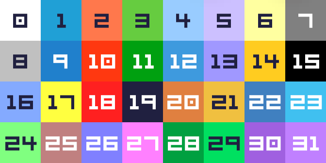

## RPG Maker MV/MZ plugins, their mods and Python tools

### PLUGIN DESCRIPTIONS

* **AddSparkles**: Adds barely visible sparkle above all collectibles on the map.
* **AppendOverlays**:  Automatically overlays images with matching `_OVR#[_POSXxPOSY]` files (WIP).
* **AutoAdvance**: Auto advancing text using `A` key.
* **BonusExpGold**: Adds functions to assign bonus EXP and Gold during battles.
* **Community_Basic**: Better auto-resize and fixes some common bugs and gives better compatibility with newer NW.JS (proper closing/no console warnings). Optionally adds some common, modded and MZ tags to MV.
* **DangerScreenTimer**: Displays a danger screen effect that intensifies as the timer runs out, with a toggleable pulsation effect. 
* **DebugJSONLoad**: Get more informative messages on JSON load errors. 
* **DiagonalMovement.js**: Diagonal movement mod with improved path-finding.
* **DTextPicture**: Mod that allows translated strings with `_` character auto-replaced to ` `.
* **ExtendedNumInput**: Adds ability to input digits with `1-9` keyboard keys to `Number Input`.
* **FixImageLoading**: Fixes individual image flicker on load.
* **FPSLimit**: FPS limiter mod.
* **FullErrorStack**: Prints the full stack trace onto the game screen on error.
* **MessageBubble**: Shows stackable, animated, auto-cleared text toasts/messages in the upper right corner.
* **MessageHide**: Toggles message and name windows simultaneously using `H` key or right-click.
* **MessageSkip**: Mod of message skip plugin that also allows to skip bubbles, movement, scroll and shorten timeouts (configurable).
* **MultiHitTargetSwitching**: Allows multi-hit (repeat) damage to switch target if the first one dies.
* **PauseTimerOnDialog**: Stops the gameplay timer during dialogues.
* **PreloadSceneImages**: Preloads/unloads images when needed, keeping shared between maps.
* **RoamingSavePath**: Allows to set custom save path (defaults to `%userprofile%\Saved Games\%GAMETITLE%`).
* **RS_ScreenShot**: Screenshots plugin.
* **SaveSystem**: Quick-save/load anywhere and auto-save on map transitions/menu.
* **TextHexColor**: Allows using hex color in `\C` tags (default, `#fff` and `#FFFFFF` formats; `\C` without param resets the color).
* **WordWrapper**: Automatic word wrapping plugin, when needed separately.

### OTHER STUFF

**RPGM MV/MZ** [opcodes](RPGM_codes.js).

**RPGM MV/MZ default color codes**:  

