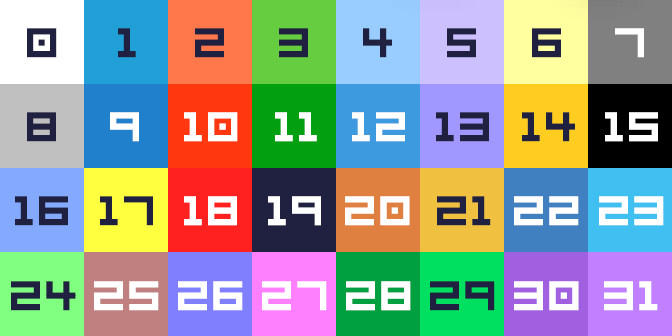

## RPG Maker MV/MZ plugins, their mods and Python tools

### PLUGIN DESCRIPTIONS

* **AutoAdvance**: Auto advancing text using `A` key.
* **DebugJSONLoad**: Get more informative messages on JSON load errors. 
* **DTextPicture**: Mod that allows translated strings with `_` character auto-replaced to ` `.
* **ExtendedNumInput**: Adds an ability to input digits with 1-9 keyboard keys to Number Input.
* **FixImageLoading**: Fixes individual image flicker on load.
* **FixNWJSstuff**: Fixes stuff bugged on newer NW.js (like closing or console warnings). Optionally adds some common tags to MV.
* **FPSLimit**: FPS limiter mod.
* **GALV_DiagonalMovement.js**: Diagonal movement mod with improved path-finding.
* **MessageBubble**: Shows stackable, animated, auto-cleared text toasts/messages in the upper right corner.
* **MessageHide**: Toggles message and name windows simultaneously using `H` key or right-click.
* **PauseTimerOnDialog**: Stops the gameplay timer during dialogues.
* **PreloadSceneImages**: Preloads/unloads images when needed, keeping shared between maps.
* **QSaveLoad**: Quick save/load anywhere (WIP).
* **RoamingSavePath**: Allows to set custom save path (defaults to `My Documents\My Games\Title`).
* **RS_ScreenShot**: Screenshots plugin.
* **TextHexColor**: Allows using hex color in `\C` tags (default, `#fff` and `#FFFFFF` formats).
* **UTA_MessageSkip**: Mod (WIP), adds ability to skip messages.
* **YEP_MessageCore**: Mod to add `\nsd` and `\nsf` tags for item descriptions.
* **WordWrapper**: Automatic word wrapping functionality.

### OTHER STUFF

**RPGM MV/MZ** [opcodes](RPGM_codes.js).

**RPGM MV/MZ default color codes**:  

